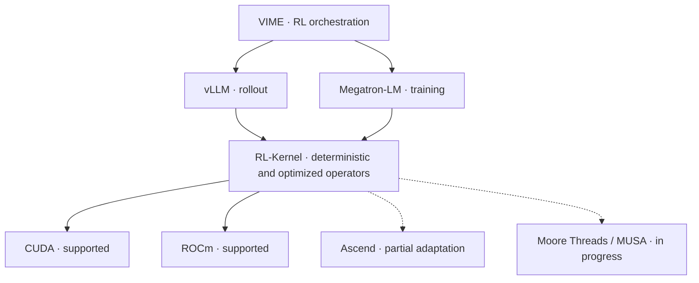

<p align="center">
  
</p>

<h1 align="center">RL-Kernel</h1>

<p align="center">
  <strong>Bitwise train–inference consistency. Faster RL post-training.</strong>
</p>

<p align="center">
  <a href="https://rl-align.github.io/RL-Kernel/"></a>
  <a href="https://rl-align.slack.com/join/shared_invite/zt-46bxj7uyt-gEK3xzwSJr_lppJsZolR~g#/shared-invite/email"></a>
  <a href="./docs/community/wechat.md"></a>
  <a href="./docs/assets/whatsapp-group.png"></a>
  <a href="https://deepwiki.com/RL-Align/RL-Kernel"></a>
  <a href="#hardware-support"></a>
  <a href="https://opensource.org/licenses/Apache-2.0"></a>
</p>

<p align="center">
  <a href="#benchmark-highlights">Results</a> ·
  <a href="#hardware-support">Hardware support</a> ·
  <a href="#architecture">Architecture</a> ·
  <a href="#quick-start">Quick start</a> ·
  <a href="https://rl-align.github.io/RL-Kernel/">Documentation</a>
</p>

**RL-Kernel** is a high-performance operator library for **GRPO and PPO-style RL
post-training**. It aligns numerical computation between rollout and training engines
with deterministic attention, dense FFN, log-probability, and collective operations.
Hardware-specific kernels optimize execution and memory use beneath the RL framework.

With **VIME + vLLM + Megatron-LM**, the published Qwen3-8B experiment achieves **zero
train–rollout LogP mismatches at every one of 200 steps**, **68.7% higher rollout
throughput**, and **8.2% lower end-to-end step time** than VIME's native production
operator path. [See the configuration and results below](#benchmark-highlights).

## Why RL-Kernel?

Rollout and training engines can produce different log probabilities for the same tokens
and model weights because their kernels, batching, and reduction orders differ. Those
differences enter the policy ratios and KL terms used by RL algorithms.

- **Exact train–inference consistency:** deterministic operator contracts align the strict
  dense-model path. The published experiment verifies exact runtime LogP agreement across
  all 200 training steps.
- **Efficient RL execution:** fused log-probability computation, optimized attention and FFN
  paths, and deterministic collectives target rollout, memory, and synchronization costs.
- **Framework integration:** provider and runtime adapters connect RL-Kernel to VIME,
  vLLM, and Megatron-LM. VIME orchestrates the workflow; RL-Kernel supplies the operators.
- **Multiple accelerators:** dense-model train–inference consistency is supported on CUDA
  and ROCm, with Ascend and Moore Threads adaptation in progress.

## Benchmark Highlights

### VIME native operators vs. VIME + RL-Kernel

The completed experiment in [PR #377](https://github.com/RL-Align/RL-Kernel/pull/377)
compares **G10**, VIME's native production operator path, with **optimized G11**, the
strict RL-Kernel path. Both use VIME with vLLM rollout and Megatron-LM training, and both
enable rollout-logp reuse. G11 applies RL-Kernel attention, FFN, and LogP on both paths.

**Setup:** Qwen3-8B BF16 · GRPO · 1 node with 8×H100 80GB · actor TP4/CP2/PP1 ·
two TP4 rollout engines · 8 prompts × 16 samples (batch 128) · 200 steps · seed 1234 ·
maximum response length 7,168 · KL-loss coefficient 0.001.

| Metric | VIME native (G10) | VIME + RL-Kernel (G11) | G11 result |
| :--- | ---: | ---: | :--- |
| Steps with nonzero train–rollout LogP mismatch | 200 / 200 | **0 / 200** | **Exact agreement at every step** |
| Maximum absolute Δlogp across the run | 1.591547 | **0** | **Zero measured difference** |
| Mean rollout time | 130.22 s/step | **82.75 s/step** | **36.5% lower** |
| Mean rollout throughput | 672.39 tok/GPU/s | **1,134.00 tok/GPU/s** | **68.7% higher** |
| Mean reference LogP time | 20.90 s/step | 20.92 s/step | Approximately equal |
| Mean actor training time | **80.51 s/step** | 107.18 s/step | 33.1% higher |
| Mean end-to-end step time | 251.99 s/step | **231.27 s/step** | **8.2% lower** |

G11 saves **47.47 seconds per rollout step**, offsetting the additional actor training
cost for a net saving of **20.72 seconds per end-to-end step**.


<details>
<summary><strong>200-step consistency and training curves</strong></summary>

G11 records `mismatch_count == 0` and `max_abs_diff == 0` at all 200 steps; G10
records nonzero mismatch at every step. The bottom panels show the runtime LogP checks.
The upper panels show raw reward and `train/kl_loss`.


</details>

**How to read these results.** Timing and throughput are arithmetic means over all 200
steps. This is a comparison of implementations under the same workload configuration;
the arms use different implementation revisions and generate different trajectories
(G11's mean response length is 4.8% higher). Exact agreement refers to the measured
train–rollout LogP on this strict path. Results come from one training seed on H100;
speedups depend on the workload and hardware. Mean raw reward is 0.528555 for G10 and
0.491445 for G11, so these results establish consistency and execution performance,
without establishing a model-quality improvement.

[Experiment and version provenance](https://github.com/RL-Align/RL-Kernel/pull/377) ·
[Published result report](https://github.com/RL-Align/RL-Kernel/tree/40db4d31982cd4a7ba28fbc96982b2af1f62921d/examples/vime_qwen3_8b_tp4_cp2_200/results/scale_reference_s1234_g10_g11_optimized) ·
[200-step CSV](https://github.com/RL-Align/RL-Kernel/blob/40db4d31982cd4a7ba28fbc96982b2af1f62921d/examples/vime_qwen3_8b_tp4_cp2_200/results/scale_reference_s1234_g10_g11_optimized/rounds.csv) ·
[Statistics JSON](https://github.com/RL-Align/RL-Kernel/blob/40db4d31982cd4a7ba28fbc96982b2af1f62921d/examples/vime_qwen3_8b_tp4_cp2_200/results/scale_reference_s1234_g10_g11_optimized/summary.json)

## Hardware Support

The following matrix tracks **dense-model train–inference consistency**. Accelerator
support and the scope of published benchmarks are listed separately.

| Vendor | Accelerator | Software stack | Dense train–inference consistency | Coverage / progress |
| :--- | :--- | :--- | :---: | :--- |
| **NVIDIA** | GPU | CUDA | ✅ **Supported** | Dense-model strict path; Qwen3-8B H100 end-to-end results above |
| **AMD** | GPU | ROCm | ✅ **Supported** | Dense-model strict path; backend-specific setup and validation |
| **Huawei** | Ascend NPU | CANN / Ascend C | 🟡 **Partially adapted** | Selected operators adapted; broader dense-model integration in progress |
| **Moore Threads** | GPU | MUSA | 🚧 **In progress** | Accelerator adaptation and dense-model integration underway |

✅ **Supported** · 🟡 **Partial adaptation** · 🚧 **Active development**

Support applies to the implemented dense-model paths; model, dtype, operator, and
parallelism coverage varies by backend. The performance numbers above are CUDA/H100
measurements. See the [installation guide](./docs/getting_started/installation.md) and
[operator catalog](./docs/operators/README.md) for backend requirements and contracts.

## Architecture

RL-Kernel sits between framework execution engines and accelerator backends. Runtime
adapters select operators through a hardware-aware registry; strict routes enforce the
required numerical contract and expose execution provenance.

The complete architecture shows the external scheduling, rollout and training engines,
operator-library layers, and hardware abstraction boundary.

<p align="center">
  
</p>

The following diagram is a concise view of the validated runtime path and accelerator
coverage.



The benchmark above validates **VIME + vLLM + Megatron-LM on CUDA**. Framework and
backend coverage are documented independently. See [runtime dispatch](./docs/design/runtime-dispatch.md)
for operator selection and strict execution contracts.

## Operator Families

| Family | Purpose | Documentation |
| :--- | :--- | :--- |
| **Attention** | Deterministic attention and context-parallel execution | [Attention](./docs/operators/attention.md) |
| **Dense FFN** | Deterministic GEMM, SiLU, and SwiGLU paths | [GEMM](./docs/operators/det-gemm.md) · [Activations](./docs/operators/activation.md) |
| **Log probabilities** | Fused, linear, batch-invariant, and vocabulary-parallel LogP | [Fused LogP](./docs/operators/fused-logp.md) · [Linear LogP](./docs/operators/linear-logp.md) · [Batch-invariant LogP](./docs/operators/batch-invariant-logp.md) |
| **GRPO / PPO objectives** | Group normalization, policy ratios, KL penalties, and clipped losses | [GRPO loss](./docs/operators/grpo-loss.md) · [Ratio / KL](./docs/operators/ratio-kl.md) |
| **Collectives** | Deterministic reductions for supported distributed topologies | [Collectives](./rl_engine/distributed/collectives.py) |

## Quick Start

Install a PyTorch build matching your accelerator runtime, then install RL-Kernel from
source. Python 3.10 or newer is required.

```bash
git clone https://github.com/RL-Align/RL-Kernel.git
cd RL-Kernel

# Native CUDA or ROCm extension
RL_KERNEL_REQUIRE_EXT=1 python -m pip install --no-build-isolation -e .
python -c "import rl_engine._C as _C; assert hasattr(_C, 'fused_logp'); print(_C.__file__)"
```

For CPU-only or pure-Python development, use `python -m pip install -e .`.
Strict train–inference consistency requires the corresponding operators and runtime
configuration in both engines. Follow the [installation guide](./docs/getting_started/installation.md)
and [quick-start guide](./docs/getting_started/quickstart.md); the full benchmark
configuration and companion VIME revision are linked in [PR #377](https://github.com/RL-Align/RL-Kernel/pull/377).

## Documentation

| Resource | What you will find |
| :--- | :--- |
| [Documentation site](https://rl-align.github.io/RL-Kernel/) | Setup, design, API, and usage guides |
| [Operator catalog](./docs/operators/README.md) | Operator contracts and backend coverage |
| [Benchmarking](./docs/benchmarking/README.md) | Benchmark entry points and reporting methods |
| [VIME integration](./docs/blog/2026-07-08-announcing-rl-kernel-linear-logp-for-vime.md) | Linear LogP integration and measurements |
| [中文：发布 vime + RL-Kernel](./docs/blog/2026-07-08-announcing-rl-kernel-linear-logp-for-vime-zh.md) | Chinese VIME integration announcement |

## Community and Contributions

Join us on [Slack](https://rl-align.slack.com/join/shared_invite/zt-46bxj7uyt-gEK3xzwSJr_lppJsZolR~g#/shared-invite/email)
or [WeChat](./docs/community/wechat.md), and
[open an issue](https://github.com/RL-Align/RL-Kernel/issues) for bugs and feature requests.
Contributions to kernels, framework integrations, hardware adaptation, and benchmarks
are welcome. See the [contributing guide](./docs/contributing/README.md).

## Acknowledgments

RL-Kernel builds on the work of the open-source AI infrastructure community, including
[VIME](https://github.com/RL-Align/vime), [vLLM](https://github.com/vllm-project/vllm),
[Megatron-LM](https://github.com/NVIDIA/Megatron-LM),
[DeepSpeed](https://github.com/deepspeedai/DeepSpeed), and
[FlashInfer](https://github.com/flashinfer-ai/flashinfer).
We thank their contributors and everyone helping bring RL-Kernel to new accelerators.

Licensed under the [Apache License 2.0](./LICENSE).
