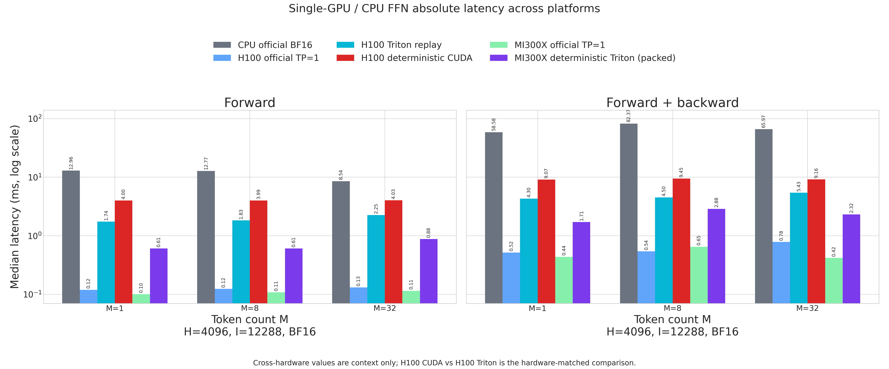
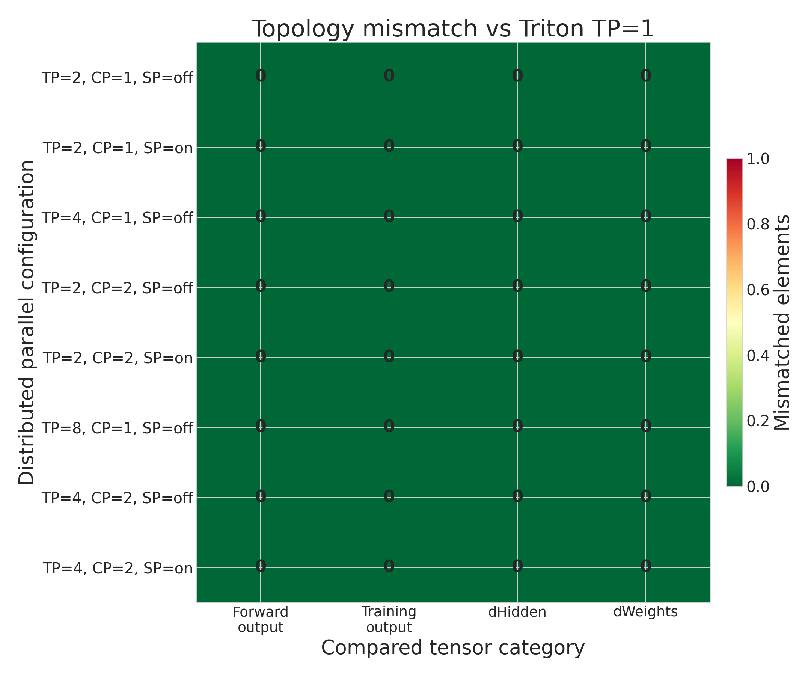
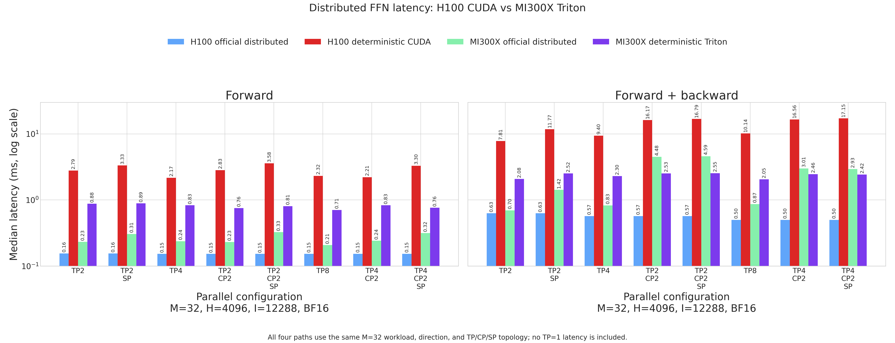

# PR #325 ROCm deterministic Triton FFN report

This is an operator-only MI300X report. It does not load or benchmark a model checkpoint.

## Comparison contract

1. **Determinism:** every Triton TP/CP/SP result is compared bitwise with the same deterministic Triton FFN at **TP=1**. The reported metric is element mismatch count; acceptance requires 0.
2. **FP16/FP32:** one separate, simple output comparison runs official Hugging Face `Qwen3MLP` at TP=1 in FP16 and FP32. FP32 is the reference.
3. **Speed:** single-GPU speed retains the official Qwen3MLP TP=1 context. Distributed speed compares four same-topology paths: H100 official/deterministic and MI300X official/deterministic.

## Environment

| Field | Value |
|---|---|
| NCCL_IB_DISABLE | 1 |
| architecture | gfx942:sramecc+:xnack- |
| deterministic_compute | ROCm-native Triton |
| deterministic_transport | fixed-tree HIP IPC with RCCL fallback on ROCm |
| distributed_speed_comparison | four same-topology H100/MI300X paths |
| git_commit | caef501101a3906c733076f31f3b5a9870169d16 |
| gpu | AMD Instinct MI300X |
| gpu_count | 8 |
| hip | 7.14.60850 |
| python | 3.12.3 |
| single_gpu_speed_context | Hugging Face Transformers Qwen3MLP, TP=1 |
| torch | 2.12.0+rocm7.14.0a20260608 |
| transformers | 5.10.4 |

## Methodology

- Operator shape: H=4096, I=12288; BF16 is used for all speed and determinism measurements.
- Single-GPU shapes use M=1/8/32. Distributed cases use the same full logical M=32 input for TP2/4/8, TP+CP, and sequence parallelism.
- The distributed comparison joins rows by topology and direction: H100 and MI300X use the same logical M=32 workload and TP/CP/SP layout. Official TP=1 latency is neither collected nor used in that distributed ratio.
- MI300X official distributed uses upstream Qwen3 FFN math with native PyTorch BF16 GEMMs and native RCCL collectives over the same shards; the deterministic path uses the current Triton FFN and fixed-order transport.
- Deterministic Triton timings use the explicit prepacked forward-weight cache. Packing happens once outside the timed region; canonical source weights remain the autograd and optimizer source of truth.
- The TP=1 cache adds 288 MiB; each TP rank holds that amount divided by TP size. Refresh cost is excluded because the benchmark measures the steady-state FFN call.
- The distributed exactness baseline is the PR's deterministic Triton FFN at TP=1. Local outputs, dHidden, and sharded dWeights are compared against their exact TP=1 slices.
- Communication contract for TP+CP+SP: forward uses 1 TP AllGather plus 1 TP ReduceScatter (2 calls). Forward+backward retains 7 AllGathers plus 3 logical ReduceScatter lanes; PR #357 merges the two independent backward gate/up lanes into one `reduce_scatter_many` call, for 9 collective invocations.
- Implementation note: the current ROCm deterministic communication operator is adopted from PR #357. This changes the implementation under test, not the benchmark comparison contract.
- Single-GPU timing: GPU events, median and p95; distributed timing: synchronized wall clock, slowest rank/sample.
- Distributed workers: one NUMA-local CPU per GPU rank to reduce host-scheduler noise in synchronized wall-clock samples.
- 10 warmups, 50 measured forward samples, and 20 measured forward+backward samples.
- `NCCL_IB_DISABLE=1` keeps the distributed run on intra-node XGMI. Median, p95, min, and max values are available in `results.json`.

Reproduce from the repository root:

```bash
python benchmarks/benchmark_rocm_ffn.py \
  --warmup 10 \
  --samples 50 \
  --training-samples 20 \
  --output-dir benchmarks/results/pr325_rocm_mi300x
```

## Results summary

- TP=1 exactness baseline: **0 mismatched elements** across topology forward outputs, training outputs, dHidden, and dWeights.
- Repeat mismatch: **0**; training/inference forward mismatch: **0**.
- Single-GPU deterministic Triton packed-cache latency is **3.92-7.64x** the official Qwen3MLP TP=1 latency across M=1/8/32 and forward/training.
- MI300X deterministic Triton latency is **0.14-0.38x** the H100 deterministic CUDA latency for the same distributed layouts. Both official distributed paths are reported alongside them.
- Versus the previous deterministic MI300X benchmark, PR #357 improves **16/16** rows, with a mean latency reduction of **22.1%**.
- The separate official-Qwen3MLP FP16 versus FP32 observation has relative-L2 error **6.544e-04** for (M,H,I)=(8,4096,12288).

## Single-GPU FFN speed

Performance only; no official-versus-Triton accuracy metric is reported here.

| Shape / direction | Official Qwen3MLP TP=1 (ms) | Deterministic Triton, packed (ms) | Triton / official TP=1 |
|---|---:|---:|---:|
| (M,H,I)=(1,4096,12288), forward | 0.1004 | 0.6053 | 6.03x |
| (M,H,I)=(1,4096,12288), forward+backward | 0.4371 | 1.7138 | 3.92x |
| (M,H,I)=(8,4096,12288), forward | 0.1077 | 0.6054 | 5.62x |
| (M,H,I)=(8,4096,12288), forward+backward | 0.6476 | 2.8767 | 4.44x |
| (M,H,I)=(32,4096,12288), forward | 0.1146 | 0.8761 | 7.64x |
| (M,H,I)=(32,4096,12288), forward+backward | 0.4182 | 2.3188 | 5.54x |

## Distributed FFN speed

Every row compares the same distributed topology and direction. No TP=1 latency is used in this table.

| Parallel layout | Direction | H100 official distributed (ms) | H100 deterministic CUDA (ms) | MI300X official distributed (ms) | MI300X deterministic Triton (ms) | H100 det / official | MI300X det / official |
|---|---|---:|---:|---:|---:|---:|---:|
| tp2 | forward | 0.1552 | 2.7896 | 0.2323 | 0.8759 | 17.97x | 3.77x |
| tp2 | train_fwd_bwd | 0.6301 | 7.8125 | 0.6984 | 2.0802 | 12.40x | 2.98x |
| tp2_sp | forward | 0.1552 | 3.3310 | 0.3066 | 0.8885 | 21.46x | 2.90x |
| tp2_sp | train_fwd_bwd | 0.6301 | 11.7695 | 1.4217 | 2.5187 | 18.68x | 1.77x |
| tp4 | forward | 0.1530 | 2.1687 | 0.2380 | 0.8324 | 14.17x | 3.50x |
| tp4 | train_fwd_bwd | 0.5714 | 9.3954 | 0.8280 | 2.2969 | 16.44x | 2.77x |
| tp2_cp2 | forward | 0.1530 | 2.8261 | 0.2317 | 0.7562 | 18.47x | 3.26x |
| tp2_cp2 | train_fwd_bwd | 0.5714 | 16.1722 | 4.4830 | 2.5281 | 28.30x | 0.56x |
| tp2_cp2_sp | forward | 0.1530 | 3.5814 | 0.3262 | 0.8067 | 23.41x | 2.47x |
| tp2_cp2_sp | train_fwd_bwd | 0.5714 | 16.7894 | 4.5870 | 2.5462 | 29.38x | 0.56x |
| tp8 | forward | 0.1537 | 2.3206 | 0.2075 | 0.7065 | 15.10x | 3.41x |
| tp8 | train_fwd_bwd | 0.5006 | 10.1375 | 0.8685 | 2.0507 | 20.25x | 2.36x |
| tp4_cp2 | forward | 0.1537 | 2.2141 | 0.2424 | 0.8306 | 14.41x | 3.43x |
| tp4_cp2 | train_fwd_bwd | 0.5006 | 16.5617 | 3.0071 | 2.4620 | 33.08x | 0.82x |
| tp4_cp2_sp | forward | 0.1537 | 3.2972 | 0.3153 | 0.7618 | 21.45x | 2.42x |
| tp4_cp2_sp | train_fwd_bwd | 0.5006 | 17.1457 | 2.9346 | 2.4232 | 34.25x | 0.83x |

### PR #357 latency change versus the previous benchmark

This comparison changes only the deterministic ROCm communication implementation. It is not included as another series in the main four-path figure.

| Parallel layout | Direction | Previous (ms) | Current (ms) | Latency reduction |
|---|---|---:|---:|---:|
| tp2 | forward | 0.9040 | 0.8759 | 3.1% |
| tp2 | train_fwd_bwd | 2.6997 | 2.0802 | 22.9% |
| tp2_sp | forward | 1.0561 | 0.8885 | 15.9% |
| tp2_sp | train_fwd_bwd | 2.9646 | 2.5187 | 15.0% |
| tp4 | forward | 0.8359 | 0.8324 | 0.4% |
| tp4 | train_fwd_bwd | 2.6999 | 2.2969 | 14.9% |
| tp2_cp2 | forward | 0.9016 | 0.7562 | 16.1% |
| tp2_cp2 | train_fwd_bwd | 3.5606 | 2.5281 | 29.0% |
| tp2_cp2_sp | forward | 1.1296 | 0.8067 | 28.6% |
| tp2_cp2_sp | train_fwd_bwd | 3.9929 | 2.5462 | 36.2% |
| tp8 | forward | 1.0860 | 0.7065 | 34.9% |
| tp8 | train_fwd_bwd | 2.5620 | 2.0507 | 20.0% |
| tp4_cp2 | forward | 1.0536 | 0.8306 | 21.2% |
| tp4_cp2 | train_fwd_bwd | 3.2599 | 2.4620 | 24.5% |
| tp4_cp2_sp | forward | 1.1928 | 0.7618 | 36.1% |
| tp4_cp2_sp | train_fwd_bwd | 3.7498 | 2.4232 | 35.4% |

## CUDA GPU and CPU performance context

The additional measurements come from [PR #321 deterministic CUDA FFN performance report](https://github.com/RL-Align/RL-Kernel/pull/321) at CUDA commit `8576fa4bf449734ae99e9b50be8756bb282a8916`. H100 Triton replays use this PR's code at `e64abab904880b877d26d04c0cfad020b992aa51`.

The same-H100 CUDA/Triton ratio is the hardware-matched comparison. CPU and MI300X columns provide absolute-latency context only; they are not hardware-normalized speed claims.

| Comparison environment | Value |
|---|---|
| CUDA GPU | NVIDIA H100 80GB HBM3 (sm_90) |
| CUDA / PyTorch | 13.0 / 2.13.0+cu130 |
| CPU | Intel(R) Xeon(R) Platinum 8468, 96 intra-op threads |
| Transformers | 5.13.1 |

### Single-GPU and CPU absolute latency

| Shape / direction | CPU official (ms) | H100 official TP=1 (ms) | H100 Triton replay (ms) | H100 CUDA (ms) | CUDA / Triton H100 | MI300X official TP=1 (ms) | MI300X Triton (ms) |
|---|---:|---:|---:|---:|---:|---:|---:|
| M=1, forward | 12.9558 | 0.1193 | 1.7381 | 3.9988 | 2.30x | 0.1004 | 0.6053 |
| M=1, forward+backward | 58.5765 | 0.5184 | 4.2997 | 9.0704 | 2.11x | 0.4371 | 1.7138 |
| M=8, forward | 12.7676 | 0.1239 | 1.8293 | 3.9923 | 2.18x | 0.1077 | 0.6054 |
| M=8, forward+backward | 82.3669 | 0.5414 | 4.5028 | 9.4500 | 2.10x | 0.6476 | 2.8767 |
| M=32, forward | 8.5392 | 0.1311 | 2.2529 | 4.0277 | 1.79x | 0.1146 | 0.8761 |
| M=32, forward+backward | 65.9689 | 0.7842 | 5.4261 | 9.1635 | 1.69x | 0.4182 | 2.3188 |

Both H100 columns used in the main distributed table are the user-supplied distributed timings. They are joined directly with MI300X rows of the same topology and direction; TP=1 values are excluded from all four columns.

## Topology exactness versus Triton TP=1

All columns are element mismatch counts. This table does not compare against the official FFN.

| Parallel layout | Forward output | Training output | dHidden | dWeights | Repeat | Train/infer |
|---|---:|---:|---:|---:|---:|---:|
| tp2 | 0 | 0 | 0 | 0 | 0 | 0 |
| tp2_sp | 0 | 0 | 0 | 0 | 0 | 0 |
| tp4 | 0 | 0 | 0 | 0 | 0 | 0 |
| tp2_cp2 | 0 | 0 | 0 | 0 | 0 | 0 |
| tp2_cp2_sp | 0 | 0 | 0 | 0 | 0 | 0 |
| tp8 | 0 | 0 | 0 | 0 | 0 | 0 |
| tp4_cp2 | 0 | 0 | 0 | 0 | 0 | 0 |
| tp4_cp2_sp | 0 | 0 | 0 | 0 | 0 | 0 |

## Simple FP16 versus FP32 observation

This is an official `Qwen3MLP` TP=1 output comparison only; it is not used to judge deterministic Triton and is not included in speed ratios.

| Shape | Candidate | Reference | Max abs | Mean abs | Relative L2 |
|---|---|---|---:|---:|---:|
| (M,H,I)=(8,4096,12288) | FP16 | FP32 | 2.046e-06 | 3.742e-07 | 6.544e-04 |

## Deterministic communication overlap

The current timing includes the fixed-order communication schedule and makes no overlap claim. Forward SP all-gather must finish before gate/up projection, and TP reduction consumes the down-projection output, so those edges are hard dependencies.

In backward, the gate and up contributions to dHidden are independent until their final ordered addition. A future implementation can place the fixed-rank reduction of one contribution on a second stream while computing the other, but it must preserve rank order, reduction tree, wait points, and gate-then-up addition order. Any optimization is accepted only if every TP=1 mismatch column remains zero.

## Figures






