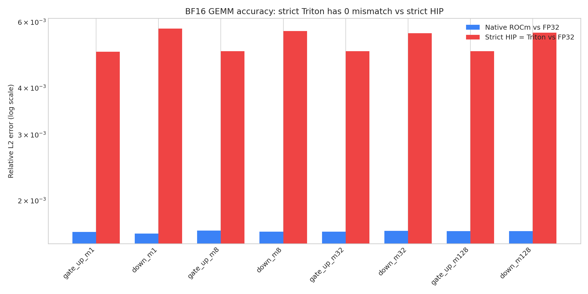

# PR #325 ROCm deterministic FFN performance analysis

> Operator-only benchmark. No model checkpoint or serving engine was used.

## Environment

| Item | Value |
|---|---|
| NCCL_IB_DISABLE | 1 |
| architecture | gfx942:sramecc+:xnack- |
| git_commit | 9dc9a68c2b3920c6e1e13226d38f5900b55ec0de |
| gpu | AMD Instinct MI300X |
| gpu_count | 8 |
| hip | 7.14.60850 |
| native_collective | torch.distributed ProcessGroupNCCL (RCCL on ROCm) |
| native_gemm | torch.matmul (ROCm rocBLAS/hipBLASLt dispatch) |
| python | 3.12.3 |
| torch | 2.12.0+rocm7.14.0a20260608 |

## Methodology

- BF16 operator inputs; FFN dimensions are H=4096 and I=12288.
- Native GEMM is `torch.matmul`; native communication calls PyTorch's ProcessGroupNCCL directly, which uses RCCL on ROCm.
- Three compute paths are measured: native ROCm, the strict HIP correctness kernels, and the new strict Triton kernels. HIP and Triton share the same deterministic RCCL collective implementation.
- All distributed paths use the same weights, TP/CP/SP sharding, and collective schedule.
- Single-GPU timing: GPU events, median and p95; distributed timing: synchronized wall clock, slowest rank per sample.
- 5 warmups, 20 measured forward/collective samples, and 10 measured forward+backward samples.
- `NCCL_IB_DISABLE=1` selects the same intra-node XGMI transport for both collective implementations. Raw median, p95, minimum, and maximum measurements are in `results.json`.

Reproduce this report from the repository root:

```bash
python benchmarks/benchmark_rocm_ffn.py \
  --warmup 5 \
  --samples 20 \
  --training-samples 10 \
  --output-dir benchmarks/results/pr325_rocm_mi300x
```

## Key findings

- Strict Triton GEMM costs 5.5-27.4x native latency, versus 43.6-1129.7x for the gfx942 HIP scalar fallback. That is a 7.9-41.2x speedup while preserving the identical BF16 arithmetic tree.
- Strict Triton SwiGLU costs 0.74-1.48x native latency; the HIP fused kernel costs 0.21-0.67x.
- Deterministic collectives cost 2.2-26.1x native RCCL latency across 2/4/8 ranks and 64 KiB/1 MiB/16 MiB per rank.
- Triton distributed FFN overhead is 6.7-9.2x for forward and 4.7-7.9x for forward+backward, compared with 31.5-106.6x and 13.0-57.1x for HIP.
- HIP and Triton produced 0 mismatched elements across all measured GEMM, SwiGLU, single-GPU FFN, and distributed FFN outputs/gradients. All distributed TP/CP/SP cases are repeat and train/inference bitwise consistent: HIP=yes, Triton=yes.
- GEMM relative-L2 error against FP32 is 0.500-0.577% for the deterministic BF16 tree versus 0.164-0.166% for native ROCm. The fixed BF16 tree buys topology invariance, not better FP32 proximity.
- Distributed FFN output drift versus native is 1.012-1.060% relative-L2. Conversely, the balanced deterministic reduction is closer to FP32 than native RCCL in 12/12 tested 4/8-rank reduction cases.

## Single-GPU GEMM

| Shape | Native (ms) | Strict HIP (ms) | Strict Triton (ms) | HIP/native | Triton/native | Triton speedup | Mismatch | Strict rel-L2 vs FP32 | Native rel-L2 vs FP32 |
|---|---:|---:|---:|---:|---:|---:|---:|---:|---:|
| gate_up_m1 | 0.0386 | 1.6818 | 0.2131 | 43.6× | 5.5× | 7.9× | 0 | 5.003e-03 | 1.651e-03 |
| down_m1 | 0.0287 | 4.8953 | 0.2816 | 170.7× | 9.8× | 17.4× | 0 | 5.769e-03 | 1.635e-03 |
| gate_up_m8 | 0.0301 | 3.1315 | 0.2534 | 104.1× | 8.4× | 12.4× | 0 | 5.018e-03 | 1.663e-03 |
| down_m8 | 0.0305 | 6.3576 | 0.3154 | 208.3× | 10.3× | 20.2× | 0 | 5.679e-03 | 1.654e-03 |
| gate_up_m32 | 0.0311 | 12.9404 | 0.4445 | 416.3× | 14.3× | 29.1× | 0 | 5.019e-03 | 1.654e-03 |
| down_m32 | 0.0297 | 16.4953 | 0.4797 | 555.0× | 16.1× | 34.4× | 0 | 5.604e-03 | 1.662e-03 |
| gate_up_m128 | 0.0507 | 45.9268 | 1.2442 | 905.2× | 24.5× | 36.9× | 0 | 5.019e-03 | 1.657e-03 |
| down_m128 | 0.0541 | 61.1382 | 1.4830 | 1129.7× | 27.4× | 41.2× | 0 | 5.623e-03 | 1.659e-03 |

## Single-GPU SwiGLU

| Case | Native PyTorch (ms) | Strict HIP (ms) | Strict Triton (ms) | HIP/native | Triton/native | Triton speedup | Mismatch | Strict/native rel-L2 |
|---|---:|---:|---:|---:|---:|---:|---:|---:|
| swiglu_forward_m1 | 0.0166 | 0.0111 | 0.0245 | 0.67x | 1.48x | 0.45x | 0 | 2.877e-03 |
| swiglu_backward_m1 | 0.0550 | 0.0126 | 0.0451 | 0.23x | 0.82x | 0.28x | 0 | 5.159e-03 |
| swiglu_forward_m8 | 0.0185 | 0.0115 | 0.0255 | 0.62x | 1.38x | 0.45x | 0 | 2.816e-03 |
| swiglu_backward_m8 | 0.0623 | 0.0130 | 0.0464 | 0.21x | 0.74x | 0.28x | 0 | 5.074e-03 |
| swiglu_forward_m32 | 0.0189 | 0.0117 | 0.0264 | 0.62x | 1.40x | 0.44x | 0 | 2.825e-03 |
| swiglu_backward_m32 | 0.0627 | 0.0129 | 0.0482 | 0.21x | 0.77x | 0.27x | 0 | 5.071e-03 |
| swiglu_forward_m128 | 0.0182 | 0.0115 | 0.0260 | 0.63x | 1.42x | 0.44x | 0 | 2.828e-03 |
| swiglu_backward_m128 | 0.0622 | 0.0132 | 0.0486 | 0.21x | 0.78x | 0.27x | 0 | 5.059e-03 |

## Single-GPU FFN

| Case | Native (ms) | Strict HIP (ms) | Strict Triton (ms) | HIP/native | Triton/native | Triton speedup | Mismatch | Output rel-L2 | Max grad rel-L2 |
|---|---:|---:|---:|---:|---:|---:|---:|---:|---:|
| ffn_forward_m1 | 0.0893 | 9.4804 | 1.9132 | 106.2× | 21.4× | 5.0× | 0 | 1.008e-02 | nan |
| ffn_train_fwd_bwd_m1 | 0.3956 | 39.0134 | 4.3589 | 98.6× | 11.0× | 9.0× | 0 | 1.008e-02 | 1.037e-02 |
| ffn_forward_m8 | 0.0958 | 14.0203 | 2.0307 | 146.3× | 21.2× | 6.9× | 0 | 9.930e-03 | nan |
| ffn_train_fwd_bwd_m8 | 0.5470 | 47.4023 | 4.7045 | 86.7× | 8.6× | 10.1× | 0 | 9.930e-03 | 1.017e-02 |
| ffn_forward_m32 | 0.1070 | 43.5072 | 2.5388 | 406.7× | 23.7× | 17.1× | 0 | 9.952e-03 | nan |
| ffn_train_fwd_bwd_m32 | 0.3958 | 107.0497 | 5.7859 | 270.5× | 14.6× | 18.5× | 0 | 9.952e-03 | 1.024e-02 |

## RCCL collectives

| Operation | Ranks | Input/rank | Native RCCL (ms) | Deterministic (ms) | Overhead | Det/native rel-L2 | Native/FP32 rel-L2 | Det/FP32 rel-L2 |
|---|---:|---:|---:|---:|---:|---:|---:|---:|
| all_reduce | 2 | 0.0625 MiB | 0.0591 | 0.5470 | 9.3× | 0.000e+00 | 1.798e-03 | 1.798e-03 |
| all_gather | 2 | 0.0625 MiB | 0.0522 | 0.5240 | 10.0× | 0.000e+00 | 0.000e+00 | 0.000e+00 |
| reduce_scatter | 2 | 0.0625 MiB | 0.0500 | 0.5611 | 11.2× | 0.000e+00 | 1.804e-03 | 1.804e-03 |
| all_reduce | 2 | 1 MiB | 0.0826 | 0.5473 | 6.6× | 0.000e+00 | 1.800e-03 | 1.800e-03 |
| all_gather | 2 | 1 MiB | 0.0748 | 0.5649 | 7.5× | 0.000e+00 | 0.000e+00 | 0.000e+00 |
| reduce_scatter | 2 | 1 MiB | 0.0692 | 0.5791 | 8.4× | 0.000e+00 | 1.803e-03 | 1.803e-03 |
| all_reduce | 2 | 16 MiB | 0.4068 | 0.8919 | 2.2× | 0.000e+00 | 1.800e-03 | 1.800e-03 |
| all_gather | 2 | 16 MiB | 0.4068 | 0.8947 | 2.2× | 0.000e+00 | 0.000e+00 | 0.000e+00 |
| reduce_scatter | 2 | 16 MiB | 0.2427 | 0.8972 | 3.7× | 0.000e+00 | 1.803e-03 | 1.803e-03 |
| all_reduce | 4 | 0.0625 MiB | 0.0636 | 0.7050 | 11.1× | 3.221e-03 | 2.674e-03 | 2.536e-03 |
| all_gather | 4 | 0.0625 MiB | 0.0573 | 0.6548 | 11.4× | 0.000e+00 | 0.000e+00 | 0.000e+00 |
| reduce_scatter | 4 | 0.0625 MiB | 0.0541 | 0.7036 | 13.0× | 3.263e-03 | 2.734e-03 | 2.559e-03 |
| all_reduce | 4 | 1 MiB | 0.0877 | 0.6830 | 7.8× | 3.256e-03 | 2.682e-03 | 2.566e-03 |
| all_gather | 4 | 1 MiB | 0.0895 | 0.6880 | 7.7× | 0.000e+00 | 0.000e+00 | 0.000e+00 |
| reduce_scatter | 4 | 1 MiB | 0.0906 | 0.7200 | 7.9× | 3.319e-03 | 2.691e-03 | 2.599e-03 |
| all_reduce | 4 | 16 MiB | 0.2430 | 1.0479 | 4.3× | 3.256e-03 | 2.682e-03 | 2.566e-03 |
| all_gather | 4 | 16 MiB | 0.4251 | 1.0416 | 2.5× | 0.000e+00 | 0.000e+00 | 0.000e+00 |
| reduce_scatter | 4 | 16 MiB | 0.1572 | 1.0507 | 6.7× | 3.319e-03 | 2.691e-03 | 2.599e-03 |
| all_reduce | 8 | 0.0625 MiB | 0.0388 | 1.0130 | 26.1× | 4.446e-03 | 3.664e-03 | 3.099e-03 |
| all_gather | 8 | 0.0625 MiB | 0.0712 | 0.9640 | 13.5× | 0.000e+00 | 0.000e+00 | 0.000e+00 |
| reduce_scatter | 8 | 0.0625 MiB | 0.0662 | 1.0662 | 16.1× | 4.879e-03 | 3.780e-03 | 3.155e-03 |
| all_reduce | 8 | 1 MiB | 0.0526 | 1.0009 | 19.0× | 4.474e-03 | 3.676e-03 | 3.110e-03 |
| all_gather | 8 | 1 MiB | 0.0896 | 0.9617 | 10.7× | 0.000e+00 | 0.000e+00 | 0.000e+00 |
| reduce_scatter | 8 | 1 MiB | 0.0663 | 1.0107 | 15.2× | 4.765e-03 | 3.768e-03 | 3.168e-03 |
| all_reduce | 8 | 16 MiB | 0.1794 | 1.3688 | 7.6× | 4.474e-03 | 3.676e-03 | 3.110e-03 |
| all_gather | 8 | 16 MiB | 0.4294 | 1.3492 | 3.1× | 0.000e+00 | 0.000e+00 | 0.000e+00 |
| reduce_scatter | 8 | 16 MiB | 0.1196 | 1.3798 | 11.5× | 4.765e-03 | 3.768e-03 | 3.168e-03 |

## Distributed FFN

| Topology | Direction | Native (ms) | Strict HIP (ms) | Strict Triton (ms) | HIP/native | Triton/native | Triton speedup | Mismatch | Output rel-L2 | Max grad rel-L2 | Triton T/I | Triton repeat |
|---|---|---:|---:|---:|---:|---:|---:|---:|---:|---:|:---:|:---:|
| tp2 | forward | 0.2150 | 22.9206 | 1.9798 | 106.6× | 9.2× | 11.6× | 0 | 1.012e-02 | nan | yes | yes |
| tp2 | train_fwd_bwd | 1.2321 | 57.0045 | 5.7878 | 46.3× | 4.7× | 9.8× | 0 | 1.012e-02 | 1.079e-02 | yes | yes |
| tp2_sp | forward | 0.2809 | 23.5957 | 2.5798 | 84.0× | 9.2× | 9.1× | 0 | 1.015e-02 | nan | yes | yes |
| tp2_sp | train_fwd_bwd | 1.0253 | 58.5607 | 7.3220 | 57.1× | 7.1× | 8.0× | 0 | 1.015e-02 | 1.083e-02 | yes | yes |
| tp4 | forward | 0.2205 | 13.6021 | 1.5211 | 61.7× | 6.9× | 8.9× | 0 | 1.031e-02 | nan | yes | yes |
| tp4 | train_fwd_bwd | 1.2806 | 33.5847 | 6.5363 | 26.2× | 5.1× | 5.1× | 0 | 1.031e-02 | 1.095e-02 | yes | yes |
| tp2_cp2 | forward | 0.2225 | 14.0999 | 1.8852 | 63.4× | 8.5× | 7.5× | 0 | 1.015e-02 | nan | yes | yes |
| tp2_cp2 | train_fwd_bwd | 1.4676 | 42.9816 | 9.2452 | 29.3× | 6.3× | 4.6× | 0 | 1.015e-02 | 1.083e-02 | yes | yes |
| tp2_cp2_sp | forward | 0.2847 | 14.6807 | 2.4424 | 51.6× | 8.6× | 6.0× | 0 | 1.022e-02 | nan | yes | yes |
| tp2_cp2_sp | train_fwd_bwd | 1.4237 | 44.0911 | 11.2019 | 31.0× | 7.9× | 3.9× | 0 | 1.022e-02 | 1.089e-02 | yes | yes |
| tp8 | forward | 0.1962 | 8.3054 | 1.7764 | 42.3× | 9.1× | 4.7× | 0 | 1.060e-02 | nan | yes | yes |
| tp8 | train_fwd_bwd | 1.1290 | 20.8277 | 7.4017 | 18.4× | 6.6× | 2.8× | 0 | 1.060e-02 | 1.126e-02 | yes | yes |
| tp4_cp2 | forward | 0.2250 | 8.4350 | 1.5096 | 37.5× | 6.7× | 5.6× | 0 | 1.033e-02 | nan | yes | yes |
| tp4_cp2 | train_fwd_bwd | 1.6478 | 26.0435 | 9.4115 | 15.8× | 5.7× | 2.8× | 0 | 1.033e-02 | 1.099e-02 | yes | yes |
| tp4_cp2_sp | forward | 0.2906 | 9.1476 | 2.2212 | 31.5× | 7.6× | 4.1× | 0 | 1.045e-02 | nan | yes | yes |
| tp4_cp2_sp | train_fwd_bwd | 2.0583 | 26.7826 | 11.6214 | 13.0× | 5.6× | 2.3× | 0 | 1.045e-02 | 1.109e-02 | yes | yes |

## Communication overlap feasibility

The reported implementations deliberately serialize compute and communication; the tables above do not claim overlap. A representative 1 MiB strict collective costs 0.5473-1.0107 ms, while Triton distributed FFN forward costs 1.5096-2.5798 ms and forward+backward costs 5.7878-11.6214 ms. Communication is therefore material after the GEMM speedup, but only some calls are structurally hideable.

- Forward SP all-gather feeds both gate/up GEMMs, and the final TP all-reduce or reduce-scatter consumes the down projection. These are dependency boundaries and cannot be hidden by simply moving them to another stream.
- Backward has one safe pipeline candidate: launch the fixed-order TP reduction for the gate contribution to `dHidden`, compute the independent up contribution, then wait and add in the existing gate-then-up order. The rank tree and BF16 addition order must remain unchanged.
- CP activation/gradient gathers are prerequisites for weight-gradient GEMMs. They can be coalesced into a fixed packed layout to amortize launch/signature validation, but are not naturally hidden by those GEMMs.
- Because the plausible overlap window is bounded by roughly one strict collective, coalescing and removing per-call host signature validation should be benchmarked before adding multi-stream scheduling complexity.

## Figures



