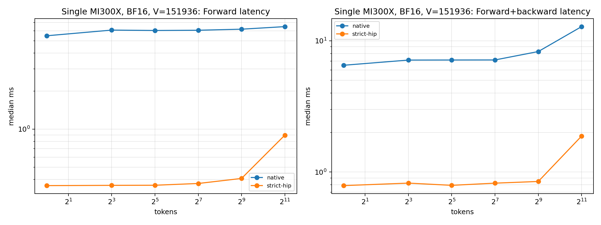
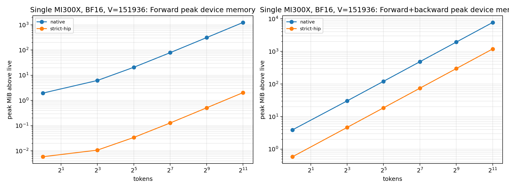
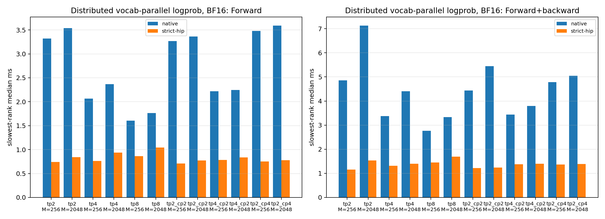

# PR #328 ROCm vocab-parallel logprob performance analysis

> Operator-only benchmark. No model checkpoint or serving engine was used.

## Environment

| Item | Value |
|---|---|
| architecture | gfx942:sramecc+:xnack- |
| extension_symbols | hip_deterministic_logp_tile_stats, hip_deterministic_logp_backward |
| git_commit | 1c73a427881252871b46936f6d14be36a22e307f |
| gpu | AMD Instinct MI300X |
| gpu_count | 8 |
| hip | 7.14.60850 |
| native_collective | torch.distributed ProcessGroupNCCL (RCCL on ROCm) |
| native_single_gpu | torch.logsumexp + gather on FP32 logits |
| python | 3.12.3 |
| torch | 2.12.0+rocm7.14.0a20260608 |

## Methodology

- Qwen3 vocabulary `V=151936` split into 64 tiles of 2374 columns; seeded logits (`randn * 2.0`), random targets, every seventh token inactive.
- Measured paths:
  - `native`: `pytorch-vocab-parallel-logp-ws2`, the WS2 vocab-parallel reference operator: a PyTorch tile loop for the per-tile FP32 `(max, sumexp)` partials, all-gather of the partials, fixed global tile-order merge, and a PyTorch autograd backward.
  - `strict-hip`: `rocm-vocab-parallel-logp-ws2`, the same contract, transport, and merge with two HIP kernels: `hip_deterministic_logp_tile_stats` reads the stored BF16/FP16/FP32 shard directly (8-element vector loads, no FP32 copy) and `hip_deterministic_logp_backward` produces the gradient in one fused pass.
- Distributed: one process per GPU; the WS2 operators all-gather per-tile `(max, sumexp)` partials over RCCL and merge them in fixed global tile order; CP ranks shard tokens and never enter the merge.
- Forward returns the selected-token logprob and the vocabulary LSE; forward+backward computes `grad_logits` for `sum(active * logp)`. The WS2 operators run with `validate=False`; the `validate=True` production entry point is measured separately.
- Single-GPU timing: GPU events, median and p95. Distributed timing: synchronized wall clock, slowest rank per sample. Peak memory is the per-call increase in `torch.cuda.max_memory_allocated` (distributed: max over ranks).
- Accuracy is against an FP64 `logsumexp` of the same (BF16-rounded) logits. Repeat = two identical calls are bitwise equal; batch-invariant = a row computed alone is bitwise equal to the same row inside the batch; TP-replicated = every TP rank holds identical bits.
- 5 warmups, 20 measured forward samples, 10 measured forward+backward samples. Raw medians, p95, minimum, maximum, and every measured path are in `results.json`.
- Tables show 2048 tokens; the figures cover the full token sweep.

Reproduce this report from the repository root:

```bash
python benchmarks/benchmark_rocm_logp.py \
  --warmup 5 \
  --samples 20 \
  --training-samples 10 \
  --report-paths ws2-reference,ws2-rocm \
  --rename ws2-reference=native,ws2-rocm=strict-hip \
  --report-baseline ws2-reference \
  --table-tokens 2048 \
  --output-dir benchmarks/results/pr328_rocm_mi300x
```

## Key findings

- Single GPU: `strict-hip` is 5.97-7.23x faster than `native` in forward and 4.94-6.83x in forward+backward, with 0.15-0.33x its peak memory.
- Distributed: `strict-hip` is 1.69-4.60x faster than `native` in forward and 1.97-4.64x in forward+backward across 6 TP/CP topologies, at 0.15x the per-rank peak memory (absolute forward 0.773-1.041 ms).
- The `hip_deterministic_logp_tile_stats` kernel alone is 10.2-10.6x faster than the PyTorch tile loop and allocates 57x less transient memory (it writes only the `[tokens, 64]` FP32 partials).
- `strict-hip` vs `native`: tile maxima are bitwise equal; sumexp partials differ only by FP32 summation order, so final outputs differ in 0-65 elements per case with relative-L2 0.0e+00-1.3e-08. Both paths are equally close to FP64.
- Repeat bitwise: yes; batch-invariant: yes; all gradients finite: yes.
- Distributed: TP-replicated and repeat bitwise on every topology: yes.

## Single-GPU logprob (BF16 logits, V=151936)

### Forward

| Tokens | Path | Median (ms) | p95 (ms) | Speedup vs native | Peak MiB | logp max-abs vs FP64 | LSE max-abs vs FP64 | Repeat | Batch-inv |
|---:|---|---:|---:|---:|---:|---:|---:|:---:|:---:|
| 2048 | native | 6.4801 | 6.7318 | 1.00× | 1245.0 | 1.557e-06 | 1.382e-06 | yes | yes |
| 2048 | strict-hip | 0.8964 | 0.9366 | 7.23× | 2.0 | 1.621e-06 | 1.318e-06 | yes | yes |

### Forward+backward

| Tokens | Path | Median (ms) | p95 (ms) | Speedup vs native | Peak MiB | Memory vs native | Grad finite |
|---:|---|---:|---:|---:|---:|---:|:---:|
| 2048 | native | 12.8275 | 12.9236 | 1.00× | 7715.7 | 1.00× | yes |
| 2048 | strict-hip | 1.8781 | 1.9318 | 6.83× | 1187.1 | 0.15× | yes |

### `strict-hip` versus `native` numerics

| Tokens | Mismatched elements (logp+LSE) | Relative L2 |
|---:|---:|---:|
| 2048 | 65 | 1.098e-08 |

## Single-GPU logprob (FP32 logits, V=151936)

### Forward

| Tokens | Path | Median (ms) | p95 (ms) | Speedup vs native | Peak MiB | logp max-abs vs FP64 | LSE max-abs vs FP64 | Repeat | Batch-inv |
|---:|---|---:|---:|---:|---:|---:|---:|:---:|:---:|
| 2048 | native | 6.0009 | 6.2081 | 1.00× | 58.0 | 1.747e-06 | 1.271e-06 | yes | yes |
| 2048 | strict-hip | 1.0045 | 1.0516 | 5.97× | 2.0 | 1.747e-06 | 1.271e-06 | yes | yes |

### Forward+backward

| Tokens | Path | Median (ms) | p95 (ms) | Speedup vs native | Peak MiB | Memory vs native | Grad finite |
|---:|---|---:|---:|---:|---:|---:|:---:|
| 2048 | native | 12.5812 | 12.7740 | 1.00× | 7122.2 | 1.00× | yes |
| 2048 | strict-hip | 2.5475 | 2.6220 | 4.94× | 2374.1 | 0.33× | yes |

### `strict-hip` versus `native` numerics

| Tokens | Mismatched elements (logp+LSE) | Relative L2 |
|---:|---:|---:|
| 2048 | 37 | 8.004e-09 |

## Distributed vocab-parallel logprob (BF16, RCCL)

### Forward

| Topology | Tokens | Path | Median (ms) | p95 (ms) | Speedup vs native | Peak MiB/rank | logp max-abs vs FP64 | TP-replicated | Repeat |
|---|---:|---|---:|---:|---:|---:|---:|:---:|:---:|
| tp2 | 2048 | native | 3.5356 | 3.5972 | 1.00× | 650.3 | 1.452e-06 | yes | yes |
| tp2 | 2048 | strict-hip | 0.8436 | 0.8830 | 4.19× | 3.0 | 1.452e-06 | yes | yes |
| tp4 | 2048 | native | 2.3684 | 2.4618 | 1.00× | 353.0 | 1.452e-06 | yes | yes |
| tp4 | 2048 | strict-hip | 0.9375 | 1.0703 | 2.53× | 2.5 | 1.452e-06 | yes | yes |
| tp8 | 2048 | native | 1.7633 | 1.9199 | 1.00× | 204.3 | 1.452e-06 | yes | yes |
| tp8 | 2048 | strict-hip | 1.0407 | 1.1309 | 1.69× | 2.3 | 1.452e-06 | yes | yes |
| tp2_cp2 | 2048 | native | 3.3620 | 3.7359 | 1.00× | 325.5 | 1.452e-06 | yes | yes |
| tp2_cp2 | 2048 | strict-hip | 0.7731 | 0.8305 | 4.35× | 1.5 | 1.452e-06 | yes | yes |
| tp4_cp2 | 2048 | native | 2.2469 | 2.5062 | 1.00× | 176.7 | 1.452e-06 | yes | yes |
| tp4_cp2 | 2048 | strict-hip | 0.8380 | 0.9284 | 2.68× | 1.3 | 1.452e-06 | yes | yes |
| tp2_cp4 | 2048 | native | 3.5902 | 3.9379 | 1.00× | 163.1 | 1.452e-06 | yes | yes |
| tp2_cp4 | 2048 | strict-hip | 0.7803 | 0.8550 | 4.60× | 0.8 | 1.452e-06 | yes | yes |

### Forward+backward

| Topology | Tokens | Path | Median (ms) | p95 (ms) | Speedup vs native | Peak MiB/rank | Memory vs native | Grad finite |
|---|---:|---|---:|---:|---:|---:|---:|:---:|
| tp2 | 2048 | native | 7.1279 | 7.1917 | 1.00× | 3857.9 | 1.00× | yes |
| tp2 | 2048 | strict-hip | 1.5376 | 1.5811 | 4.64× | 593.6 | 0.15× | yes |
| tp4 | 2048 | native | 4.4086 | 4.5749 | 1.00× | 1929.0 | 1.00× | yes |
| tp4 | 2048 | strict-hip | 1.4017 | 1.5074 | 3.15× | 296.8 | 0.15× | yes |
| tp8 | 2048 | native | 3.3382 | 3.7182 | 1.00× | 964.5 | 1.00× | yes |
| tp8 | 2048 | strict-hip | 1.6933 | 2.2111 | 1.97× | 148.5 | 0.15× | yes |
| tp2_cp2 | 2048 | native | 5.4500 | 5.4998 | 1.00× | 1929.0 | 1.00× | yes |
| tp2_cp2 | 2048 | strict-hip | 1.2361 | 1.6392 | 4.41× | 296.8 | 0.15× | yes |
| tp4_cp2 | 2048 | native | 3.7984 | 3.9900 | 1.00× | 964.5 | 1.00× | yes |
| tp4_cp2 | 2048 | strict-hip | 1.3963 | 1.5687 | 2.72× | 148.4 | 0.15× | yes |
| tp2_cp4 | 2048 | native | 5.0433 | 5.2447 | 1.00× | 964.5 | 1.00× | yes |
| tp2_cp4 | 2048 | strict-hip | 1.3849 | 1.9775 | 3.64× | 148.4 | 0.15× | yes |

### `strict-hip` versus `native` numerics (distributed)

| Topology | Tokens | Mismatched elements (logp+LSE) | Relative L2 |
|---|---:|---:|---:|
| tp2 | 2048 | 54 | 9.958e-09 |
| tp4 | 2048 | 54 | 9.958e-09 |
| tp8 | 2048 | 54 | 9.958e-09 |
| tp2_cp2 | 2048 | 54 | 1.069e-08 |
| tp4_cp2 | 2048 | 54 | 1.069e-08 |
| tp2_cp4 | 2048 | 54 | 1.162e-08 |

## Figures







