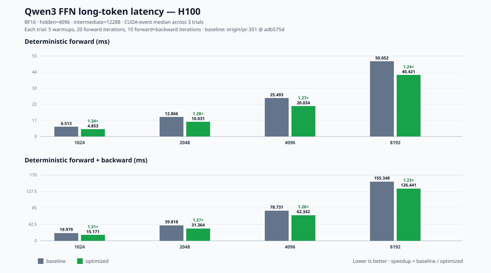
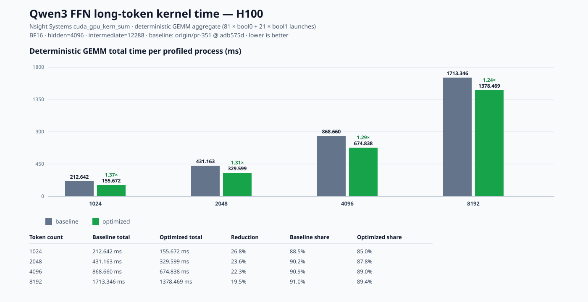

# Qwen FFN long-token performance

This report compares the current long-token optimization with the PR #351
baseline (`origin/pr-351`, `adb575d`). Both versions use the same H100 node,
CUDA/PyTorch environment, BF16 inputs, and Qwen3-8B FFN shape
`hidden=4096, intermediate=12288`.

## CUDA-event latency

The headline numbers use CUDA events, not Nsight-instrumented timings. Each
trial uses 5 warmups, 20 forward iterations, and 10 forward+backward
iterations. Values below are the median of three trial medians.

| Tokens | Det forward baseline (ms) | Det forward optimized (ms) | Speedup | Det fwd+bwd baseline (ms) | Det fwd+bwd optimized (ms) | Speedup |
|---:|---:|---:|---:|---:|---:|---:|
| 1024 | 6.5133 | 4.8531 | 1.34x | 19.9793 | 15.1710 | 1.32x |
| 2048 | 12.8660 | 10.0312 | 1.28x | 39.8176 | 31.3641 | 1.27x |
| 4096 | 25.4928 | 20.0340 | 1.27x | 78.7306 | 62.3420 | 1.26x |
| 8192 | 50.0523 | 40.4205 | 1.24x | 155.3476 | 126.4405 | 1.23x |



The production path is unchanged and was measured as a control. Its three-trial
medians were within normal run-to-run variation (forward: -0.6%, -0.5%, +0.0%,
-2.5%; forward+backward: -1.2%, -6.7%, -3.7%, +1.5% for 1024/2048/4096/8192).
These control measurements are not used as an optimization claim.

## Nsight Systems kernel attribution

The following aggregates come from `cuda_gpu_kern_sum`. Each row sums the two
deterministic GEMM templates (`(bool)0`: 81 launches and `(bool)1`: 21 launches)
in the profiled process. `Time (%)` is the share of all GPU kernel time in that
profile, not end-to-end application latency.

| Tokens | Baseline det GEMM total (ms) | Optimized det GEMM total (ms) | Reduction | Baseline GPU share | Optimized GPU share |
|---:|---:|---:|---:|---:|---:|
| 1024 | 212.642 | 155.672 | 26.8% | 88.7% | 85.0% |
| 2048 | 431.163 | 329.599 | 23.6% | 90.4% | 87.8% |
| 4096 | 868.660 | 674.838 | 22.3% | 91.1% | 89.0% |
| 8192 | 1713.346 | 1378.469 | 19.5% | 91.2% | 89.4% |



The deterministic GEMM remains the dominant GPU workload. The reduction stays
positive as token count grows, while the percentage benefit decreases because
the long-token GEMM work increasingly dominates the fixed launch and reduction
overheads.

## Reproduction

The CUDA-event benchmark is in
`bench_long_token_std.py`:

```bash
PYTHONPATH=$PWD python benchmarks/results/qwen_ffn_h100_trace/bench_long_token_std.py \
  1024 2048 4096 8192
```

Run it once with `origin/pr-351` built and once with the candidate kernel. The
Nsight CSVs were generated with:

```bash
nsys stats --report cuda_gpu_kern_sum --format csv \
  --force-export=true <profile>.nsys-rep
```

Raw `.nsys-rep` and JSON timing logs are kept outside the repository; the SVGs
and this summary are the review artifacts.
