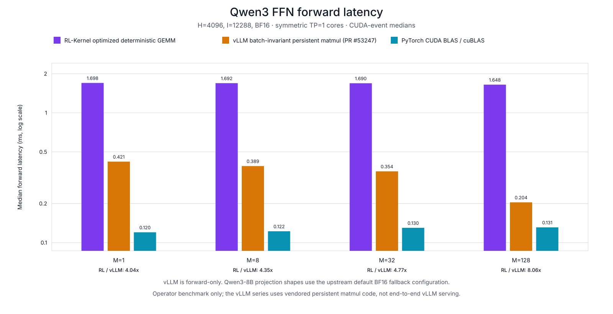
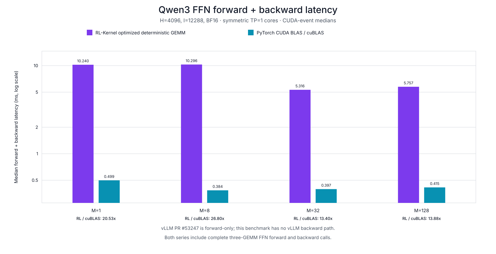

# Qwen3 FFN deterministic GEMM layout benchmark

This is an operator-only single-GPU benchmark. It does not load or benchmark a model checkpoint, tokenizer, dataset, or serving engine.

## Comparison contract

- **Baseline:** deterministic single-GPU layout contract from `7207ebd`. The benchmark replays the removed weight and weight-gradient transpose/copy materializations with the preserved legacy CUDA APIs.
- **Candidate:** the current TP=1 `qwen3_ffn` layout core, which consumes canonical `[out, in]` weights and directly returns canonical contiguous weight gradients.
- **Production reference:** symmetric TP=1 `torch.matmul` core matching `qwen3_ffn(deterministic=False)`. This environment prefers the cuBLAS backend; the exact CUDA BLAS algorithm is not a `torch.matmul` API guarantee.
- **Batch-invariant reference (forward only):** vLLM's persistent Triton matmul, including the configuration selection from [PR #53247](https://github.com/vllm-project/vllm/pull/53247), pinned to merge commit `7797b6022c129b862e45ae6aed08822e65d1bccb`. The three-GEMM core uses the same weight transpose views and RL-Kernel SwiGLU operation as the other stripped TP=1 paths.
- All timed paths have the same stripped TP=1 wrapper scope and use identical seeded BF16 tensors. The optimized deterministic core must match the public deterministic `qwen3_ffn` bitwise; cuBLAS and vLLM outputs must agree with the optimized output within the recorded numerical sanity bounds.
- Every requested M passes correctness before any timing. Bitwise acceptance only applies to the two RL-Kernel deterministic paths. The vLLM path separately must produce a bitwise-identical first output row across batch sizes for an identical first input row.
- This is an in-process layout-path comparison, not a separately loaded old binary. Keeping the GEMM arithmetic and build fixed isolates the removed layout materializations from cross-build and cross-run noise.

## Environment

| Field | Value |
|---|---|
| timestamp_utc | 2026-08-27T13:36:55.766522+00:00 |
| gpu | NVIDIA H100 80GB HBM3 |
| compute_capability | 9.0 |
| total_memory_gib | 79.1806640625 |
| device | cuda:0 |
| torch | 2.13.0+cu130 |
| torch_git_version | cf30153c4c131c8164ee7798e5022d810682e2cb |
| cuda | 13.0 |
| triton | 3.7.1 |
| nvidia_driver | 595.71.05 |
| preferred_blas_library | Cublas |
| allow_tf32 | False |
| allow_bf16_reduced_precision_reduction | True |
| allow_fp16_reduced_precision_reduction | True |
| deterministic_algorithms | False |
| float32_matmul_precision | highest |
| cublas_workspace_config |  |
| python | 3.11.15 |
| git_commit | 15ca2627f7b1843901dc59877d6db623399dd86a |
| git_dirty | True |
| benchmark_sha256 | 9d742035c4b27bf157d489f6fabd10839f725fd9fecbc626781ec1e38dcbd791 |
| vllm_kernel_sha256 | a86b95d78d12f692326e5a9d58ebcd7588fcb76d0777be1b1ccfb441a9e65d01 |
| vllm_config_sha256 | 0f341b8d28fa66eb350eb14444a027135922053c83e960a19999b3ccbdd2dd80 |
| extension_sha256 | 873db73fee1c8f4b01ec0d3bf7641275ef1aa674c904f5992e728fff39703d47 |
| sm90_probe_kernel_launches | 1 |
| visible_devices | 5 |

## Methodology

- Shape: H=4096, I=12288, M=[1, 8, 32, 128]; dtype=BF16.
- CUDA events measure complete FFN forward and complete forward+backward calls.
- Forward samples follow a prefix-balanced 24-permutation cycle over legacy, optimized, CUDA BLAS, and vLLM. Forward+backward samples follow the balanced six-permutation cycle for the three training-capable paths.
- 3 warmups per path, 20 forward samples, and 10 forward+backward samples.
- Tables and figures report median latency; JSON also contains p95, min, max, and every raw sample.

Reproduction command:

```bash
python benchmarks/benchmark_qwen_ffn_layout.py --tokens 1,8,32,128 --hidden 4096 --intermediate 12288 --seed 20260825 --warmup 3 --samples 20 --training-samples 10 --device-index 0 --output-dir benchmarks/results/qwen_ffn_layout_h100
```

## Performance

| M | Direction | Replayed legacy (ms) | Optimized deterministic (ms) | CUDA BLAS (ms) | vLLM batch-invariant (ms) | Layout speedup | Optimized / cuBLAS | Optimized / vLLM |
|---:|---|---:|---:|---:|---:|---:|---:|---:|
| 1 | Forward | 4.0067 | 1.6985 | 0.1201 | 0.4206 | 2.36x | 14.14x | 4.04x |
| 1 | Forward + backward | 12.5711 | 10.2401 | 0.4988 | — | 1.23x | 20.53x | — |
| 8 | Forward | 3.9980 | 1.6922 | 0.1223 | 0.3890 | 2.36x | 13.84x | 4.35x |
| 8 | Forward + backward | 12.6107 | 10.2956 | 0.3841 | — | 1.22x | 26.80x | — |
| 32 | Forward | 3.9976 | 1.6896 | 0.1300 | 0.3544 | 2.37x | 13.00x | 4.77x |
| 32 | Forward + backward | 9.0592 | 5.3159 | 0.3966 | — | 1.70x | 13.40x | — |
| 128 | Forward | 3.9509 | 1.6476 | 0.1312 | 0.2043 | 2.40x | 12.56x | 8.06x |
| 128 | Forward + backward | 9.4869 | 5.7568 | 0.4147 | — | 1.65x | 13.88x | — |





`Layout speedup = replayed / optimized`; `determinism overhead = optimized / CUDA BLAS`; `optimized / vLLM = optimized latency / vLLM latency`. vLLM is forward-only; both numerical references are outside the RL-Kernel bitwise acceptance contract.

## Deterministic bitwise consistency

All entries are raw BF16 bit mismatch counts. Timing is skipped if any value is non-zero.

| M | Output | Training output | dHidden | dGateW | dUpW | dDownW |
|---:|---:|---:|---:|---:|---:|---:|
| 1 | 0 | 0 | 0 | 0 | 0 | 0 |
| 8 | 0 | 0 | 0 | 0 | 0 | 0 |
| 32 | 0 | 0 | 0 | 0 | 0 | 0 |
| 128 | 0 | 0 | 0 | 0 | 0 | 0 |

For every M, legacy train/inference parity, optimized train/inference parity, and timed optimized-core/public-`qwen3_ffn` parity also have zero raw BF16 mismatches.

## Production matmul numerical agreement

CUDA BLAS uses a different reduction order and is not expected to match bitwise. The seeded benchmark requires relative L2 error <= 2.0% and normalized maximum error <= 5.0% for every output and gradient before timing.

| M | Output rel. L2 | dHidden rel. L2 | Max dWeight rel. L2 | Max normalized error | Max bitwise mismatch |
|---:|---:|---:|---:|---:|---:|
| 1 | 0.955% | 1.001% | 0.807% | 1.500% | 81.592% |
| 8 | 0.960% | 1.000% | 0.809% | 1.242% | 82.437% |
| 32 | 0.965% | 0.997% | 0.811% | 1.379% | 82.052% |
| 128 | 0.965% | 0.998% | 0.848% | 1.235% | 82.207% |

## vLLM batch-invariant forward checks

The vendored vLLM path uses fixed-K persistent matmuls with FP32 accumulation. It is checked numerically against the optimized RL-Kernel output for each M; it is not expected to match RL-Kernel bitwise because the two kernels use different accumulation orders.

| M | Relative L2 | Normalized max error | Bitwise mismatch fraction |
|---:|---:|---:|---:|
| 1 | 0.954% | 1.000% | 81.567% |
| 8 | 0.960% | 0.990% | 82.443% |
| 32 | 0.965% | 0.837% | 82.053% |
| 128 | 0.965% | 0.948% | 82.207% |

The identical-first-row batch-invariance gate passed with raw BF16 mismatch counts `M=1: 0, M=8: 0, M=32: 0, M=128: 0` against M=1.

### vLLM matmul configuration selection

Each projection records the exact configuration selected by the vendored upstream table. `default` means the upstream BF16 fallback, not a shape-tuned PR entry.

| M | Projection | GEMM shape (M,N,K) | Selection | BM / BN / BK | Warps | Stages |
|---:|---|---|---|---|---:|---:|
| 1 | gate | (1,12288,4096) | default | 128 / 128 / 64 | 8 | 3 |
| 1 | up | (1,12288,4096) | default | 128 / 128 / 64 | 8 | 3 |
| 1 | down | (1,4096,12288) | default | 128 / 128 / 64 | 8 | 3 |
| 8 | gate | (8,12288,4096) | default | 128 / 128 / 64 | 8 | 3 |
| 8 | up | (8,12288,4096) | default | 128 / 128 / 64 | 8 | 3 |
| 8 | down | (8,4096,12288) | default | 128 / 128 / 64 | 8 | 3 |
| 32 | gate | (32,12288,4096) | default | 128 / 128 / 64 | 8 | 3 |
| 32 | up | (32,12288,4096) | default | 128 / 128 / 64 | 8 | 3 |
| 32 | down | (32,4096,12288) | default | 128 / 128 / 64 | 8 | 3 |
| 128 | gate | (128,12288,4096) | default | 128 / 128 / 64 | 8 | 3 |
| 128 | up | (128,12288,4096) | default | 128 / 128 / 64 | 8 | 3 |
| 128 | down | (128,4096,12288) | default | 128 / 128 / 64 | 8 | 3 |

For H=4096 and I=12288, none of the three projection shapes matches PR #53247's BF16 tuned table. These measurements therefore exercise the vendored persistent kernel with its upstream default configuration; they are not results for a shape-tuned PR entry.

Vendored kernel source: [7797b6022c129b862e45ae6aed08822e65d1bccb](https://github.com/vllm-project/vllm/blob/7797b6022c129b862e45ae6aed08822e65d1bccb/vllm/model_executor/layers/batch_invariant.py).

## Layout-copy profile

One warmed call at M=128 was captured with `torch.profiler`.

| Direction | Legacy direct copies | Optimized direct copies | Legacy GEMMs | Optimized GEMMs |
|---|---:|---:|---:|---:|
| Forward | 6 | 0 | 3 | 3 |
| Forward + backward | 18 | 9 | 9 | 9 |

The production reference executes 3 forward and 9 forward+backward `aten::mm` calls. Representative profiled CUDA GEMM kernels: `nvjet_sm90_tst_256x128_64x4_1x2_h_bz_coopA_NTT`, `nvjet_sm90_tst_64x64_64x13_2x1_v_bz_NNT`, `nvjet_sm90_tst_64x64_64x13_2x1_v_bz_TNT`, `nvjet_sm90_tst_96x128_64x6_2x1_v_bz_NNN`, `nvjet_sm90_tst_96x128_64x7_2x1_v_bz_TNN`.
