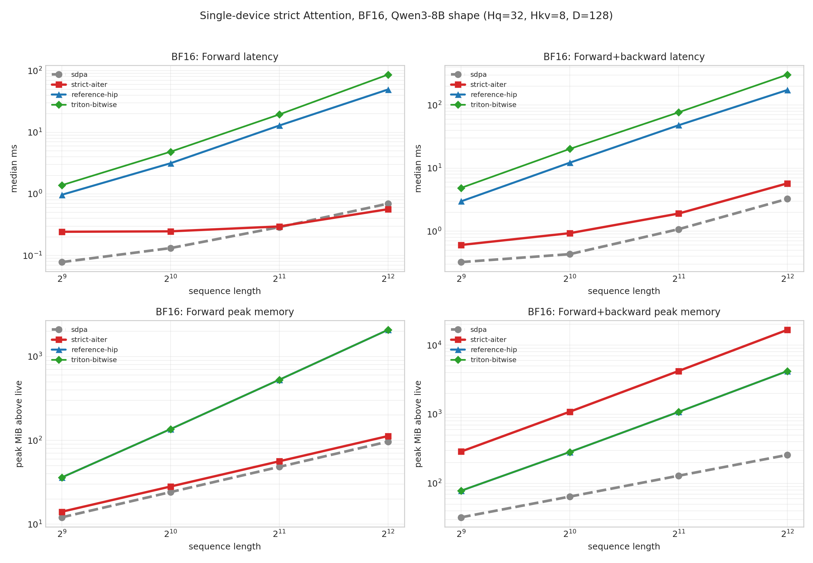
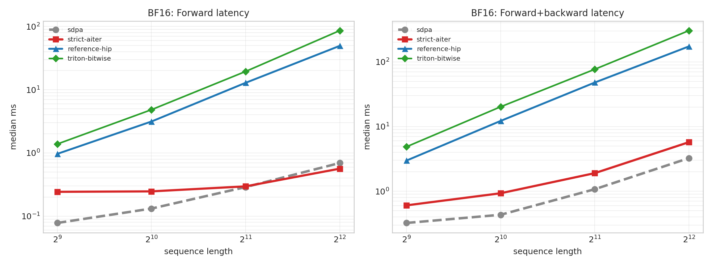
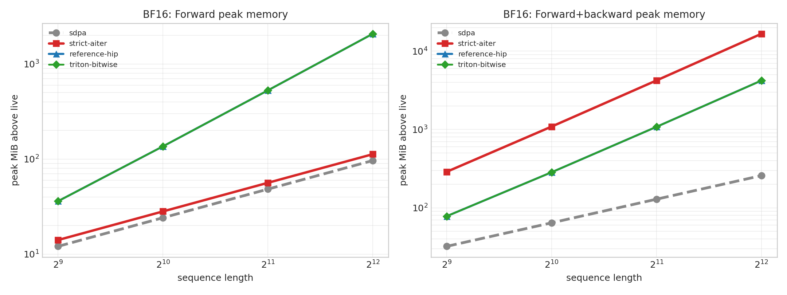
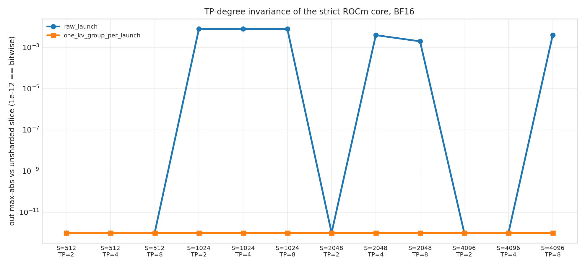

# WS2 strict ROCm Attention — bitwise parity and performance

> Operator-only benchmark. No model checkpoint or serving engine was used;
> the shapes are Qwen3-8B's attention shapes.

## Environment

| Item | Value |
|---|---|
| architecture | gfx942:sramecc+:xnack- |
| cuda | None |
| extension_attention_symbols | deterministic_attention_backward, deterministic_attention_forward |
| gpu | AMD Instinct MI300X |
| gpu_count | 8 |
| hip | 7.14.60850 |
| native_collective | torch.distributed ProcessGroupNCCL (RCCL on ROCm) |
| python | 3.12.3 |
| torch | 2.12.0+rocm7.14.0a20260608 |
| triton | 3.7.0 |

## Methodology

- Operator shape: `Hq=32`, `Hkv=8`, `D=128`, `B=1`, causal; sequence sweep 512, 1024, 2048, 4096.
- Measured paths:
  - `sdpa`: `torch.nn.functional.scaled_dot_product_attention`. **Speed baseline only** — as in PR #325, no accuracy comparison is mixed into the speed table.
  - `strict-aiter`: `StrictRocmAiterCKAttentionCore`, the ROCm production core (AITER CK dense MHA, non-split API, one logical batch row per launch).
  - `reference-hip`: `_C.deterministic_attention_forward/backward`, the materializing FP32 reference core hipified from the shared `.cu`.
  - `triton-bitwise`: `TritonDeterministicAttentionOp`, whose contract is bit-identity with `reference-hip`.
- Timing: CUDA events, median and p95. Peak memory is the per-call increase in `torch.cuda.max_memory_allocated` above what was live before the call.
- Accuracy is against an FP64 oracle over the same BF16/FP16-rounded inputs. Repeat = two identical calls are bitwise equal; batch-invariant = a row computed alone is bitwise equal to the same row inside a batch.
- 5 warmups, 20 measured forward samples, 10 measured forward+backward samples. Raw medians, p95, min and max are in `results.json`.

Reproduce from the repository root:

```bash
python benchmarks/benchmark_ws2_rocm_attention.py \
  --seq-lens 512,1024,2048,4096 \
  --dtypes bf16,fp16 \
  --warmup 5 --samples 20 \
  --training-samples 10 \
  --output-dir benchmarks/results/ws2_rocm_mi300x
```

## Bitwise parity: Triton port vs the native reference core

Acceptance is 0 mismatched elements. This is the contract the Triton core exists to hold.

| dtype | S | out mismatched | lse mismatched | dQ | dK | dV | bitwise |
|---|---:|---:|---:|---:|---:|---:|:---:|
| bf16 | 512 | 0 | 0 | 0 | 0 | 0 | yes |
| bf16 | 1024 | 0 | 0 | 0 | 0 | 0 | yes |
| bf16 | 2048 | 0 | 0 | 0 | 0 | 0 | yes |
| bf16 | 4096 | 0 | 0 | 0 | 0 | 0 | yes |
| fp16 | 512 | 0 | 0 | n/a | n/a | n/a | yes |
| fp16 | 1024 | 0 | 0 | n/a | n/a | n/a | yes |
| fp16 | 2048 | 0 | 0 | n/a | n/a | n/a | yes |
| fp16 | 4096 | 0 | 0 | n/a | n/a | n/a | yes |

`dQ/dK/dV` are measured on the BF16 sweep only; `n/a` marks the FP16 rows.

## Single-GPU Attention (bf16)

### Forward

| S | Path | Median (ms) | p95 (ms) | vs sdpa | Peak MiB | out max-abs vs FP64 | lse max-abs vs FP64 | Repeat |
|---:|---|---:|---:|---:|---:|---:|---:|:---:|
| 512 | sdpa | 0.0782 | 0.0820 | 1.00x | 12.1 | 8.195e-03 | n/a | yes |
| 512 | strict-aiter | 0.2428 | 0.2560 | 3.11x | 14.1 | 2.468e-02 | 8.359e-07 | yes |
| 512 | reference-hip | 0.9659 | 1.0030 | 12.36x | 36.1 | 7.741e-03 | 8.111e-07 | yes |
| 512 | triton-bitwise | 1.3816 | 1.3923 | 17.68x | 36.1 | 7.741e-03 | 8.111e-07 | yes |
| 1024 | sdpa | 0.1319 | 0.1430 | 1.00x | 24.1 | 1.027e-02 | n/a | yes |
| 1024 | strict-aiter | 0.2468 | 0.2578 | 1.87x | 28.1 | 2.609e-02 | 1.213e-06 | yes |
| 1024 | reference-hip | 3.1389 | 3.1914 | 23.79x | 136.1 | 7.810e-03 | 8.732e-07 | yes |
| 1024 | triton-bitwise | 4.8240 | 4.8720 | 36.56x | 136.1 | 7.810e-03 | 8.732e-07 | yes |
| 2048 | sdpa | 0.2887 | 0.2975 | 1.00x | 48.3 | 7.994e-03 | n/a | yes |
| 2048 | strict-aiter | 0.2962 | 0.3394 | 1.03x | 56.3 | 2.027e-02 | 2.288e-06 | yes |
| 2048 | reference-hip | 12.8467 | 12.9922 | 44.50x | 528.2 | 7.804e-03 | 1.142e-06 | yes |
| 2048 | triton-bitwise | 19.4226 | 19.5024 | 67.28x | 528.3 | 7.804e-03 | 1.142e-06 | yes |
| 4096 | sdpa | 0.6936 | 0.7149 | 1.00x | 96.5 | 9.604e-03 | n/a | yes |
| 4096 | strict-aiter | 0.5644 | 0.6076 | 0.81x | 112.5 | 2.138e-02 | 3.967e-06 | yes |
| 4096 | reference-hip | 49.3624 | 49.5342 | 71.17x | 2080.5 | 7.808e-03 | 1.381e-06 | yes |
| 4096 | triton-bitwise | 86.0655 | 86.5760 | 124.08x | 2080.5 | 7.808e-03 | 1.381e-06 | yes |

### Forward+backward

| S | Path | Median (ms) | p95 (ms) | vs sdpa | Peak MiB |
|---:|---|---:|---:|---:|---:|
| 512 | sdpa | 0.3228 | 0.3510 | 1.00x | 32.2 |
| 512 | strict-aiter | 0.6039 | 0.6560 | 1.87x | 288.2 |
| 512 | reference-hip | 2.9714 | 2.9876 | 9.21x | 78.1 |
| 512 | triton-bitwise | 4.8578 | 4.9374 | 15.05x | 78.1 |
| 1024 | sdpa | 0.4319 | 0.5795 | 1.00x | 64.3 |
| 1024 | strict-aiter | 0.9293 | 0.9651 | 2.15x | 1088.4 |
| 1024 | reference-hip | 12.2009 | 12.2835 | 28.25x | 284.3 |
| 1024 | triton-bitwise | 20.1771 | 20.3071 | 46.71x | 284.3 |
| 2048 | sdpa | 1.0735 | 1.1114 | 1.00x | 128.8 |
| 2048 | strict-aiter | 1.9019 | 1.9802 | 1.77x | 4224.8 |
| 2048 | reference-hip | 47.8741 | 48.1225 | 44.60x | 1080.5 |
| 2048 | triton-bitwise | 76.7414 | 76.9707 | 71.49x | 1080.5 |
| 4096 | sdpa | 3.2464 | 3.3146 | 1.00x | 257.5 |
| 4096 | strict-aiter | 5.7304 | 5.7861 | 1.77x | 16641.5 |
| 4096 | reference-hip | 173.3365 | 173.5448 | 53.39x | 4209.0 |
| 4096 | triton-bitwise | 304.1032 | 304.4993 | 93.67x | 4209.0 |

## Single-GPU Attention (fp16)

### Forward

| S | Path | Median (ms) | p95 (ms) | vs sdpa | Peak MiB | out max-abs vs FP64 | lse max-abs vs FP64 | Repeat |
|---:|---|---:|---:|---:|---:|---:|---:|:---:|
| 512 | sdpa | 0.0700 | 0.0735 | 1.00x | 12.1 | 1.042e-03 | n/a | yes |
| 512 | strict-aiter | 0.2472 | 0.3623 | 3.53x | 14.1 | 2.046e-03 | 8.756e-07 | yes |
| 512 | reference-hip | 0.9588 | 1.0180 | 13.70x | 36.1 | 9.702e-04 | 8.340e-07 | yes |
| 512 | triton-bitwise | 1.3660 | 1.3787 | 19.52x | 36.1 | 9.702e-04 | 8.340e-07 | yes |
| 1024 | sdpa | 0.1286 | 0.1435 | 1.00x | 24.1 | 1.053e-03 | n/a | yes |
| 1024 | strict-aiter | 0.2423 | 0.2602 | 1.88x | 28.1 | 2.299e-03 | 1.250e-06 | yes |
| 1024 | reference-hip | 3.0663 | 3.1218 | 23.84x | 136.1 | 9.757e-04 | 1.011e-06 | yes |
| 1024 | triton-bitwise | 4.7733 | 4.8062 | 37.11x | 136.1 | 9.757e-04 | 1.011e-06 | yes |
| 2048 | sdpa | 0.2866 | 0.2997 | 1.00x | 48.3 | 9.099e-04 | n/a | yes |
| 2048 | strict-aiter | 0.2942 | 0.3034 | 1.03x | 56.3 | 2.053e-03 | 2.540e-06 | yes |
| 2048 | reference-hip | 12.5348 | 12.7376 | 43.73x | 528.2 | 9.099e-04 | 1.103e-06 | yes |
| 2048 | triton-bitwise | 19.1882 | 19.2599 | 66.94x | 528.3 | 9.099e-04 | 1.103e-06 | yes |
| 4096 | sdpa | 1.0565 | 1.0855 | 1.00x | 96.5 | 9.905e-04 | n/a | yes |
| 4096 | strict-aiter | 0.5813 | 0.6200 | 0.55x | 112.5 | 1.953e-03 | 3.805e-06 | yes |
| 4096 | reference-hip | 48.3115 | 48.4132 | 45.73x | 2080.5 | 9.681e-04 | 1.511e-06 | yes |
| 4096 | triton-bitwise | 84.9071 | 85.0736 | 80.36x | 2080.5 | 9.681e-04 | 1.511e-06 | yes |

### Forward+backward

| S | Path | Median (ms) | p95 (ms) | vs sdpa | Peak MiB |
|---:|---|---:|---:|---:|---:|
| 512 | sdpa | 0.3177 | 0.3328 | 1.00x | 32.2 |
| 512 | strict-aiter | 1.0677 | 1.1007 | 3.36x | 288.2 |
| 512 | reference-hip | 3.0363 | 3.0744 | 9.56x | 78.1 |
| 512 | triton-bitwise | 4.7821 | 4.8698 | 15.05x | 78.1 |
| 1024 | sdpa | 0.4399 | 0.5001 | 1.00x | 64.4 |
| 1024 | strict-aiter | 0.8350 | 0.9122 | 1.90x | 1088.4 |
| 1024 | reference-hip | 12.0068 | 12.0713 | 27.29x | 284.3 |
| 1024 | triton-bitwise | 19.3157 | 19.4640 | 43.91x | 284.3 |
| 2048 | sdpa | 1.1766 | 1.2269 | 1.00x | 128.5 |
| 2048 | strict-aiter | 1.9060 | 2.0250 | 1.62x | 4224.8 |
| 2048 | reference-hip | 47.5117 | 47.7373 | 40.38x | 1080.5 |
| 2048 | triton-bitwise | 75.7950 | 76.0022 | 64.42x | 1080.5 |
| 4096 | sdpa | 4.0247 | 4.0579 | 1.00x | 257.0 |
| 4096 | strict-aiter | 5.8475 | 5.8916 | 1.45x | 16641.5 |
| 4096 | reference-hip | 171.5617 | 171.7337 | 42.63x | 4209.0 |
| 4096 | triton-bitwise | 300.1215 | 301.8339 | 74.57x | 4209.0 |

## Production core versus the reference core

These are two different kernels, so this is a tolerance comparison, not a parity claim. It is here to size the gap, not to assert equality.

| dtype | S | out max-abs | out relative-L2 | lse max-abs |
|---|---:|---:|---:|---:|
| bf16 | 512 | 3.125e-02 | 5.420e-03 | 9.537e-07 |
| bf16 | 1024 | 3.125e-02 | 5.505e-03 | 1.431e-06 |
| bf16 | 2048 | 1.562e-02 | 5.595e-03 | 1.907e-06 |
| bf16 | 4096 | 1.562e-02 | 5.633e-03 | 3.815e-06 |
| fp16 | 512 | 1.953e-03 | 4.323e-04 | 9.537e-07 |
| fp16 | 1024 | 1.953e-03 | 4.466e-04 | 1.431e-06 |
| fp16 | 2048 | 1.953e-03 | 4.503e-04 | 2.861e-06 |
| fp16 | 4096 | 1.953e-03 | 4.580e-04 | 3.815e-06 |

## Batch-composition invariance

A row computed alone must be bitwise equal to the same row inside a batch. The strict ROCm core rejects `B > 1` outright, so for that path the property is structural rather than measured.

| S | Path | Bitwise | Mismatched | Note |
|---:|---|:---:|---:|---|
| 512 | sdpa | yes | 0 | measured |
| 512 | strict-aiter | yes | 0 | core executes one logical batch row per launch |
| 512 | reference-hip | yes | 0 | measured |
| 512 | triton-bitwise | yes | 0 | measured |
| 1024 | sdpa | yes | 0 | measured |
| 1024 | strict-aiter | yes | 0 | core executes one logical batch row per launch |
| 1024 | reference-hip | yes | 0 | measured |
| 1024 | triton-bitwise | yes | 0 | measured |
| 2048 | sdpa | yes | 0 | measured |
| 2048 | strict-aiter | yes | 0 | core executes one logical batch row per launch |
| 2048 | reference-hip | yes | 0 | measured |
| 2048 | triton-bitwise | yes | 0 | measured |
| 4096 | sdpa | yes | 0 | measured |
| 4096 | strict-aiter | yes | 0 | core executes one logical batch row per launch |
| 4096 | reference-hip | yes | 0 | measured |
| 4096 | triton-bitwise | yes | 0 | measured |

## TP-degree invariance of the strict ROCm core

A head shard computed under TP=N versus the same slice of an unsharded run. TP performs no cross-rank reduction in attention, so any nonzero value means the kernel's result depends on how many heads shared the launch. `raw_launch` is one launch for all heads; `one_kv_group_per_launch` is the schedule the Vime provider actually uses.

| S | Schedule | TP | Local Hq | Local Hkv | out max-abs | lse max-abs | Invariant |
|---:|---|---:|---:|---:|---:|---:|:---:|
| 512 | raw_launch | 2 | 16 | 4 | 0.000000e+00 | 0.000000e+00 | yes |
| 512 | raw_launch | 4 | 8 | 2 | 0.000000e+00 | 0.000000e+00 | yes |
| 512 | raw_launch | 8 | 4 | 1 | 0.000000e+00 | 0.000000e+00 | yes |
| 512 | one_kv_group_per_launch | 2 | 16 | 4 | 0.000000e+00 | 0.000000e+00 | yes |
| 512 | one_kv_group_per_launch | 4 | 8 | 2 | 0.000000e+00 | 0.000000e+00 | yes |
| 512 | one_kv_group_per_launch | 8 | 4 | 1 | 0.000000e+00 | 0.000000e+00 | yes |
| 1024 | raw_launch | 2 | 16 | 4 | 7.812500e-03 | 1.907349e-06 | **no** |
| 1024 | raw_launch | 4 | 8 | 2 | 7.812500e-03 | 1.907349e-06 | **no** |
| 1024 | raw_launch | 8 | 4 | 1 | 7.812500e-03 | 1.907349e-06 | **no** |
| 1024 | one_kv_group_per_launch | 2 | 16 | 4 | 0.000000e+00 | 0.000000e+00 | yes |
| 1024 | one_kv_group_per_launch | 4 | 8 | 2 | 0.000000e+00 | 0.000000e+00 | yes |
| 1024 | one_kv_group_per_launch | 8 | 4 | 1 | 0.000000e+00 | 0.000000e+00 | yes |
| 2048 | raw_launch | 2 | 16 | 4 | 0.000000e+00 | 0.000000e+00 | yes |
| 2048 | raw_launch | 4 | 8 | 2 | 3.906250e-03 | 2.861023e-06 | **no** |
| 2048 | raw_launch | 8 | 4 | 1 | 1.953125e-03 | 2.861023e-06 | **no** |
| 2048 | one_kv_group_per_launch | 2 | 16 | 4 | 0.000000e+00 | 0.000000e+00 | yes |
| 2048 | one_kv_group_per_launch | 4 | 8 | 2 | 0.000000e+00 | 0.000000e+00 | yes |
| 2048 | one_kv_group_per_launch | 8 | 4 | 1 | 0.000000e+00 | 0.000000e+00 | yes |
| 4096 | raw_launch | 2 | 16 | 4 | 0.000000e+00 | 0.000000e+00 | yes |
| 4096 | raw_launch | 4 | 8 | 2 | 0.000000e+00 | 0.000000e+00 | yes |
| 4096 | raw_launch | 8 | 4 | 1 | 3.906250e-03 | 4.768372e-06 | **no** |
| 4096 | one_kv_group_per_launch | 2 | 16 | 4 | 0.000000e+00 | 0.000000e+00 | yes |
| 4096 | one_kv_group_per_launch | 4 | 8 | 2 | 0.000000e+00 | 0.000000e+00 | yes |
| 4096 | one_kv_group_per_launch | 8 | 4 | 1 | 0.000000e+00 | 0.000000e+00 | yes |

## Distributed CP (RCCL AG/RS transport)

Schedule: all-gather Q/K/V and the position ids over the CP group, run the strict core once on the full sequence, reduce-scatter `(out, lse)` back to this rank's query range. Acceptance is bitwise against a CP=1 run of the same core.

| Topology | World | TP | CP | Replicas | S | Median (ms) | p95 (ms) | Peak MiB/rank | out bitwise | lse bitwise | Repeat |
|---|---:|---:|---:|---:|---:|---:|---:|---:|:---:|:---:|:---:|
| tp1_cp2 | 2 | 1 | 2 | 1 | 4096 | 1.8352 | 1.8726 | 160.5 | yes | yes | yes |
| tp2_cp2 | 4 | 2 | 2 | 1 | 4096 | 1.2114 | 1.3138 | 80.3 | yes | yes | yes |
| tp1_cp4 | 4 | 1 | 4 | 1 | 4096 | 1.3973 | 1.4363 | 160.5 | yes | yes | yes |
| tp2_cp2_x2 | 8 | 2 | 2 | 2 | 4096 | 1.2297 | 1.2948 | 80.3 | yes | yes | yes |
| tp2_cp4 | 8 | 2 | 4 | 1 | 4096 | 1.2594 | 1.3294 | 80.3 | yes | yes | yes |
| tp1_cp8 | 8 | 1 | 8 | 1 | 4096 | 1.4112 | 2.2029 | 160.5 | yes | yes | yes |

## Figures

`reference-hip` and `triton-bitwise` allocate exactly the same buffers, so their memory curves coincide and the later-drawn series hides the earlier one.










